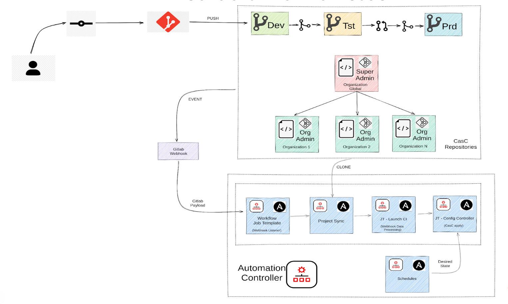

One of the discussions we had when we were talking about the collection desing was if the configuration approach should be called Infrastructure or Configuration as Code, so We'd like to highlight the difference between Configuration as Code vs. Infrastructure as Code.

Configuration as code (referred to as CasC or CAC) and Infrastructure as Code (IaC) are often referred to as the same thing, but IaC is about managing your IT infrastructure. This includes servers, networking, load balancing, and security.

Configuration as code is about how your software components interact with each other. If you change a setting on your application or product, it can be built and tested earlier in the pipeline and released with a higher confidence.

Now that some concepts are clear, let's summarize what the collection will do. Basically, the collection is compose by three ansible roles:

- **filetree_read**: An ansible role which reads variables from a hierarchical and scalable directory structure which is grouped based on the configuration code life-cycle. It could be used to run the role filetree_read to load variables followed by dispatch role to apply the configuration.
- **object_diff**: The role filetree_create is intended to be used as the first step to begin using the Configuration as Code on Ansible Tower or Ansible Automation Controller, when you already have a running instance of any of them. Obviously, you also could start to write your objects as code from scratch, but the idea behind the creation of that role is to simplify your lives and make that task a little bit easier.
- **filetree_create**: An ansible role to manage the object diff of the AWX or Automation Controller configuration. This role leverage the controller_object_diff.py lookup plugin of the redhat_cop.controller_configuration, comparing two lists, one taken directly from the API and the other one from the git repository, and it could be used to delete objects in the AWX or Automation Controller that are not defined in the git repository list.
- **dispatch**: An Ansible Role to run all roles on Ansible Controller.

Automation Webhook can be used to link a Git repository and Ansible automation natively. Once a repo link is setup, Ansible catches events (commits: push, merge, jobs, etc) from the Git system (GitHub, GitHub Enterprise, GitLab) and uses them to automatically trigger automation jobs to update projects, inventories, and perform deployments, all without requiring yet another third-party tool such as Jenkins.

The benefits of having to use and manage the configuration of one less tool is clear. With these new capabilities, there is no need for an additional CI tool such as Jenkins to monitor repos and launch automation jobs when changes occur. There is no need to sync job parameters, manage user access and monitor activity across systems. Less moving parts means there are less things that could break and less risk of credentials leaking or your CI system being exploited to deploy things to production.

Utilizing the Automation Webhook capabilities in Ansible Tower / Controller, you can implement agentless GitOps workflows that go beyond just cloud-native systems and manage existing IT infrastructure or Configuration such as cloud services, networking gear or software configuring, which is the our case.

**Automation Controller Workflow CasC**

*Automation Controller Workflow CasC*

The workflow will have the following steps:

- **Workflow Job Template (Controller Object)**: It's the captures the data triggering the following actions. Basically, will call Two Tasks:
  - Project Sync: It will do a git clone, and depending on whether it needs to download any collections or roles that it doesn't have in the execution environment, it will do so at this point.
  - Job Template - Launch CI: The data sent from through the [payload](https://docs.ansible.com/automation-controller/latest/html/userguide/webhooks.html#payload-output) is processed and converted into Extra vars.
    - Job Template - Config Controller: These variables are applied with a Job Template which calls a playbook to create/modify the objects in the controller.

Let's talk about how to achieve the ***Desired State*** idea, which is implemented through schedules at controller object type. Basically, it will schedule a recurring execution of the Job Template that applies the changes to the objects in the controller. An example of this implementation is at [drop_diff.yml](roles/../../../roles/object_diff/tests/drop_diff.yml). The job will compare the objects that exist in the controller with what exists in the repository, the logic will delete those that are not found as code. Yeap, you're right, in a way is acting as ArgoCD / Openshift GitOps, but for Controller objects and using Ansible. It should be noted that desired state feature hasn't been implemented to all objects yet, just in the following objects:

- credential_types
- credentials
- group
- host
- inventory
- inventory_sources
- job_templates
- organizations
- projects
- teams ([Issue opened](https://issues.redhat.com/projects/AAP/issues/AAP-2393): There's no option to differenciate the externally generated teams)
- users
- workflow_job_templates
  - workflow_job_template_node

**Sample Organization Directory Structure**

The directory structure is defined through variables can be found in the [defaults file](roles/../../../roles/filetree_read/defaults/main.yml), giving the user the flexibility to define their own structure.

**Playbooks**

The playbooks [config-controller-filetree.yml](roles/../../../roles/filetree_read/tests/config-controller-filetree.yml) and [drop_diff.yml](roles/../../../roles/object_diff/tests/drop_diff.yml) can be used as an example of how to use the configuration as code defined earlier.

**License**

GPLv3

**Author Information**

- [@silvinux](https://github.com/silvinux)
- [@ivarmu](https://github.com/ivarmu)
